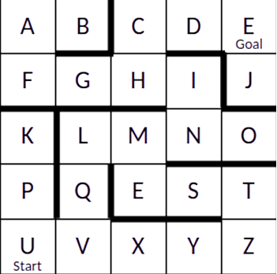
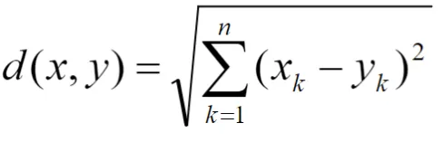

# Comparação de Desempenho entre Algoritmos A* e Busca Gulosa

# Introdução
Na área da Inteligência Artificial, os algoritmos de busca informada representam estratégias avançadas que utilizam conhecimento específico do problema para encontrar soluções de maneira mais eficiente. Ao contrário das buscas cegas, esses algoritmos empregam funções heurísticas para estimar o custo até o objetivo, permitindo uma exploração mais direcionada e eficaz do espaço de estados. Em problemas que envolvem a busca por caminhos, como a navegação em labirintos, essas estratégias são aplicadas após modelar o problema como um grafo. Nesse contexto, algoritmos como A* (A estrela) e Busca Gulosa (Best-First Search) se destacam por suas abordagens distintas na utilização de informações heurísticas para alcançar a solução desejada.

# Objetivo 
Implementar e comparar dois diferentes algoritmos de busca informada (A* e Busca Gulosa) aplicados ao problema do labirinto.

<a name="labirinto"></a>
<p align="center">
  
  <br>
  <em>Figura 1: Disposição do labirinto</em>
</p>


Observa-se pela disposição do labirinto que o melhor/menor caminho a ser encontrado, partindo de 'U' e alcançando 'E', é: 
U V Q L M N I H C D E

# Implementação
A implementação foi realizada em C++. O labirinto foi modelado como um grafo não direcionado onde cada posição representa um nó. A função heurística utilizada calcula a distância euclidiana entre cada nó e o objetivo.


## Características do Grafo Utilizado
Para aplicar algoritmos de busca informada foi nessário ajustar a estrutura do grafo. Como os algortimos de busca ordenada utilizam as informações do problema para encotrar a solução, foi necessário adicinar o peso às arestas do grafo, simulando a distância de uma posição até outra. Dessa forma, o grafo utilizado é um grafo não direcionado e ponderado, com arestas de peso 1 para qualquer aresta com nó vizinho.

## Fundamentação Teórica

### Busca Informada
A busca informada, também conhecida como busca heurística, é uma classe de algoritmos de busca que utiliza conhecimento específico do domínio do problema para encontrar soluções que são mais eficientes quando comparadas com a busca cega, por exemplo. Este conhecimento é incorporado através de uma função heurística h(n), que estima o custo do caminho mais barato de um nó n até o objetivo.

#### Função Heurística
Uma função heurística h(n) deve satisfazer certas propriedades para garantir o comportamento desejado do algoritmo:

1. **Admissibilidade**: h(n) nunca deve superestimar o custo real até o objetivo
   - h(n) ≤ h*(n), onde h*(n) é o custo real
   - Garante otimalidade para o A*

2. **Consistência**: Satisfaz a desigualdade triangular
   - h(n) ≤ c(n,n') + h(n') para todo sucessor n' de n
   - c(n,n') é o custo do caminho de n a n'

#### Distância Euclidiana como Heurística
Para o problema do labirinto, foi utilizada a distância euclidiana como função heurística:
- h(n) = √((x₂-x₁)² + (y₂-y₁)²)
- É admissível pois representa a menor distância possível entre dois pontos
- É consistente pois satisfaz a desigualdade triangular


## Calculo da Função h(n)
A função h(n) indica a distância em linha reta do nó n até a meta,ou seja, a estimativa de custo de n até a meta.
Para calcular a função h(n), utilizou-se a distância euclidiana, calculada a partir dos valores das variações na vertical(y) e na horizontal(x) de uma posição qualquer do labirinto até a meta estabelecida (no caso 'E'), considerando que 1 quadrado em x ou em y representam 1 unidade de distância, assim como os pesos das arestas do grafo. 

<a name="labirinto"></a>
<p align="center">
  
  <br>
  <em>Figura 2: Fórmula para calcular a distância euclidiana</em>
</p>


Dessa forma, ao calcular as respectivas distancias para os pares [x,y], foi atribuido os valores a uma estrutura de hash que, dado o valor de uma posição do labirinto (representada por um caractere) é atribuida como chave para um valor real de distância, representando assim a função h(n). Isso foi feito no C++ com a estrutura unordered_map da biblioteca padrão (STL), com um tipo representado por <char,double>. 


## Descrição dos Algoritmos Implementados

Os algoritmos de busca informada utilizam conhecimento específico do problema (heurística) para tomar decisões sobre qual caminho seguir. A heurística h(n) fornece uma estimativa do custo do nó atual até o objetivo, permitindo que o algoritmo priorize caminhos mais promissores.

Para este problema:
- Cada nó representa uma posição no labirinto
- A heurística h(n) é a distância euclidiana até o objetivo
- As arestas têm peso 1, representando o custo de movimento entre posições adjacentes

### A* (A Estrela)
O A* é um algoritmo que combina busca pelo melhor caminho (custo g) com busca informada (heurística h).

#### Propriedades do A*
- **Completude**: A* é completo se:
   - O fator de ramificação é finito
   - Todos os custos das ações são ≥ ε (onde ε > 0)

- **Otimalidade**: A* é ótimo se:
   - A heurística h(n) é admissível
   - Operando em um grafo de árvore
   - h(n) é consistente (para grafos gerais)

- **Complexidade**:
   - Tempo: O(b^d), onde b é o fator de ramificação e d é a profundidade
   - Espaço: O(b^d), pois mantém todos os nós na memória

- **Funcionamento Implementado**:
  1. Mantém duas listas:
     - Lista aberta (openSet): nós a serem explorados, ordenados por f(n)
     - Lista fechada (closedSet): nós já visitados
  
  2. Para cada nó, a função de avaliação f(n) é calculada da seguinte forma:
     - g(n): custo real do caminho do início até n
     - h(n): estimativa do custo de n até o objetivo
     - f(n) = g(n) + h(n): custo total estimado
  
  3. Processo de busca:
     ```
     Enquanto openSet não estiver vazia:
       1. Seleciona nó com menor f(n)
       2. Se é o objetivo, reconstrói e retorna caminho
       3. Move nó para closedSet
       4. Para cada vizinho não visitado:
          - Calcula novo g = g(atual) + custo_aresta
          - Se novo caminho é melhor:
            * Atualiza pai do vizinho
            * Atualiza g(vizinho)
            * Atualiza f(vizinho) = g(vizinho) + h(vizinho)
            * Adiciona vizinho ao openSet
     ```

  4. Estruturas de dados utilizadas:
     - `priority_queue`: para openSet, ordenada por f(n)
     - `unordered_map<char, double>`: para gScore
     - `unordered_map<char, char>`: para cameFrom (reconstrução do caminho)

### Busca Gulosa (Best-First Search)
A Busca Gulosa pode ser vista como  uma simplificação do A* que considera apenas a heurística h(n), ignorando o custo do caminho g(n).

#### Propriedades da Busca Gulosa
- **Completude**: Não é completa em geral
   - Pode ficar presa em loops infinitos
   - Completa apenas em espaços de estados finitos com detecção de ciclos

- **Otimalidade**: Não garante otimalidade
   - Toma decisões localmente ótimas
   - Pode encontrar caminhos subótimos

- **Complexidade**:
   - Tempo: O(b^m), onde b é o fator de ramificação e m é a profundidade máxima
   - Espaço: O(b^m), mantém todos os nós na memória

- **Funcionamento Implementado**:
  1. Estruturas principais:
     - Lista aberta: nós a explorar, ordenados por h(n)
     - Lista fechada: nós já visitados
  
  2. Processo de decisão:
     - Escolhe sempre o nó com menor h(n)
     - Ignora completamente o custo do caminho (g)
  
  3. Algoritmo:
     ```
     Enquanto openSet não estiver vazia:
       1. Seleciona nó com menor h(n)
       2. Se é o objetivo, reconstrói e retorna caminho
       3. Move nó para closedSet
       4. Para cada vizinho não visitado:
          - Adiciona ao openSet com prioridade h(vizinho)
          - Registra pai para reconstrução do caminho
     ```

  4. Estruturas de dados:
     - `priority_queue`: para openSet, ordenada por h(n)
     - `unordered_map<char, char>`: para cameFrom

### Comparação de Funcionamento
- **A***:
  - Considera custo real (g) + estimativa (h)
  - Mantém controle de custos acumulados
  - Garante caminho ótimo se h(n) for admissível
  - Exemplo: Para nó 'V':
    * g('U') = 1 (custo de U->V)
    * h('U') = distância euclidiana até 'E'
    * f('U') = g('U') + h('U')

- **Busca Gulosa**:
  - Considera apenas estimativa (h)
  - Não mantém controle de custos
  - Mais rápida mas pode não encontrar caminho ótimo
  - Exemplo: Para nó 'V':
    * Considera apenas h('U') = distância euclidiana até 'E'

# Medições de Desempenho

## Tempo de Execução
- Medido usando a biblioteca chrono
- Contabilizado em microsegundos

## Consumo de Memória
Para ambos os algoritmos, foi calculado:
- Número máximo de nós na fila de prioridade
- Número de nós visitados
- Tamanho dos mapas auxiliares
- Memória total utilizada em bytes

## Completude e Optimalidade
- Verificação se encontram solução
- Análise da qualidade do caminho encontrado

# Análise dos Resultados

## Testes para Análise de Desempenho
Para mensurar e validar o desempenho dos Algoritmos foram executados vários testes. A seguir, destaca-se 5 deles para análise de resultados.
### Resultados dos Testes

#### Teste 1
- **A***
  - Máximo de nós na fila: 4
  - Nós visitados: 21
  - Tamanho dos mapas: 41
  - Memória total: 518 bytes
  - Iterações: 20
  - Caminho: U -> V -> Q -> L -> M -> N -> I -> H -> C -> D -> E
  - Tempo: 86 microsegundos

- **Busca Gulosa**
  - Máximo de nós na fila: 5
  - Nós visitados: 16
  - Tamanho dos mapas: 15
  - Memória total: 151 bytes
  - Iterações: 12
  - Caminho: U -> V -> Q -> L -> M -> N -> I -> H -> C -> D -> E
  - Tempo: 34 microsegundos

#### Teste 2
- **A***
  - Máximo de nós na fila: 4
  - Nós visitados: 21
  - Tamanho dos mapas: 41
  - Memória total: 518 bytes
  - Iterações: 20
  - Caminho: U -> V -> Q -> L -> M -> N -> I -> H -> C -> D -> E
  - Tempo: 108 microsegundos

- **Busca Gulosa**
  - Máximo de nós na fila: 5
  - Nós visitados: 16
  - Tamanho dos mapas: 15
  - Memória total: 151 bytes
  - Iterações: 12
  - Caminho: U -> V -> Q -> L -> M -> N -> I -> H -> C -> D -> E
  - Tempo: 57 microsegundos

#### Teste 3
- **A***
  - Máximo de nós na fila: 4
  - Nós visitados: 21
  - Tamanho dos mapas: 41
  - Memória total: 518 bytes
  - Iterações: 20
  - Caminho: U -> V -> Q -> L -> M -> N -> I -> H -> C -> D -> E
  - Tempo: 87 microsegundos

- **Busca Gulosa**
  - Máximo de nós na fila: 5
  - Nós visitados: 16
  - Tamanho dos mapas: 15
  - Memória total: 151 bytes
  - Iterações: 12
  - Caminho: U -> V -> Q -> L -> M -> N -> I -> H -> C -> D -> E
  - Tempo: 38 microsegundos

#### Teste 4
- **A***
  - Máximo de nós na fila: 4
  - Nós visitados: 21
  - Tamanho dos mapas: 41
  - Memória total: 518 bytes
  - Iterações: 20
  - Caminho: U -> V -> Q -> L -> M -> N -> I -> H -> C -> D -> E
  - Tempo: 92 microsegundos

- **Busca Gulosa**
  - Máximo de nós na fila: 5
  - Nós visitados: 16
  - Tamanho dos mapas: 15
  - Memória total: 151 bytes
  - Iterações: 12
  - Caminho: U -> V -> Q -> L -> M -> N -> I -> H -> C -> D -> E
  - Tempo: 52 microsegundos

#### Teste 5
- **A***
  - Máximo de nós na fila: 4
  - Nós visitados: 21
  - Tamanho dos mapas: 41
  - Memória total: 518 bytes
  - Iterações: 20
  - Caminho: U -> V -> Q -> L -> M -> N -> I -> H -> C -> D -> E
  - Tempo: 92 microsegundos

- **Busca Gulosa**
  - Máximo de nós na fila: 5
  - Nós visitados: 16
  - Tamanho dos mapas: 15
  - Memória total: 151 bytes
  - Iterações: 12
  - Caminho: U -> V -> Q -> L -> M -> N -> I -> H -> C -> D -> E
  - Tempo: 52 microsegundos

## Observações Encontradas
- **Optimalidade**: Ambos algoritmos encontraram o caminho "ótimo" neste caso específico que é a solução esperada
- **Tempo de Execução**: Busca Gulosa foi mais rápida que o A*, visitou menos nós e teve menor número de iterações
- **Consumo de Memória**: A* consumiu mais memória devido ao controle adicional de custos e gerenciamento dos nós com estuturas adicionais. 
- **Completude**: Ambos encontraram solução em todos os testes, embora isso pode não acontecer sempre para o algoritmo de busca gulosa.

## Análise Comparativa dos Algoritmos

### Médias dos Resultados 

- **A*** (A estrela)
  - Média do máximo de nós na fila: 4
  - Média dos nós visitados: 21
  - Média do tamanho dos mapas: 41
  - Média da memória total: 518
  - Média de iterações: 20
  - Caminho: U -> V -> Q -> L -> M -> N -> I -> H -> C -> D -> E
  - Tempo médio: 93 microsegundos
  

- **Busca Gulosa**
  - Média do máximo de nós na fila: 5
  - Média dos nós visitados: 16 
  - Média do tamanho dos mapas: 15
  - Média da memória total: 151,  
  - Média de iterações: 12
  - Caminho: U -> V -> Q -> L -> M -> N -> I -> H -> C -> D -> E
  - Tempo médio: 46.6 microsegundos
  

- **Tempo**: Busca Gulosa mostrou-se mais rápida por ser mais simples
- **Memória**: A* utilizou mais memória devido aos mapas adicionais
- **Completude**: Ambos completos para este problema
- **Optimalidade**: Ambos ótimos neste caso específico

### Razões para o Comportamento Observado
1. **Estrutura do Problema**:
   - Labirinto relativamente pequeno
   - Heurística bem informada (distância euclidiana)
   - Poucos obstáculos e caminhos alternativos

2. **Características do A***:
   - Maior overhead por controlar g(n)
   - Garantia de otimalidade com custo de memória
   - Exploração mais sistemática

3. **Características da Busca Gulosa**:
   - Mais leve por usar apenas h(n)
   - Menor overhead de processamento
   - Pode falhar em problemas mais complexos

# Conclusão
A implementação e análise dos algoritmos A* e Busca Gulosa mostrou que, para este problema específico, a Busca Gulosa apresentou melhor desempenho em tempo e memória. No entanto, é importante notar que isso se deve às características particulares do problema e da heurística utilizada. Para esse labirinto menor e com caminhos bem definidos, a relação entre nós vizinhos ficou, de certa forma, "mais simples" e, por isso o algoritmo de busca gulosa teve vantagem. Além disso, é importante destacar que o algoritmo A* gerencia os nós com mais estruturas, o acarreta em mais uso de memória e até mesmo maior tempo de execução para esse problema em específico. Isso acontece porque o A* precisa armazenar os caminhos alternativos e manter em memória os nós da "fronteira" de busca. Porém, por mais que para este problema o algoritmo de busca gulosa tenha sido ótimo e obteve melhor performance, nem sempre isso é observado. É possível que este algoritmo fique preso em loop infinito e reconheça como melhor solução somene mínimos locais, prejudicando assim a eficiência do algoritmo para casos de caminhos mais complexos ou uma rede maior que conecta os nós. 

Portanto, de acordo com o que foi apresentado, é possível concluir que para problemas mais "simples", o algoritmo de busca gulosa atende e é capaz de alcançar a meta, assim como o algoritmo A*. Ambos encontraram a solução ótima e ambos completos. Porém, para outras classes de problema, o algoritmo A* pode performar melhor e apresentar melhor desempenho. Em geral, ambos suficientes para o problema proposto.


# Compilação e Execução

O projeto possui um arquivo Makefile que realiza todo o procedimento de compilação e execução. Para tanto, temos as seguintes diretrizes de execução:


| Comando                |  Função                                                                                           |                     
| -----------------------| ------------------------------------------------------------------------------------------------- |
|  `make clean`          | Apaga a última compilação realizada contida na pasta build                                        |
|  `make`                | Executa a compilação do programa utilizando o gcc, e o resultado vai para a pasta build           |
|  `make run`            | Executa o programa da pasta build após a realização da compilação                                 |

---

# Autores
- **Anielly Gonçalves**: anielly@aluno.cefetmg.br
- **Emanuel Vieira Tavares**:emanuel@aluno.cefetmg.br 

  DECOM-DV/CEFET-MG.
  2024/2.
